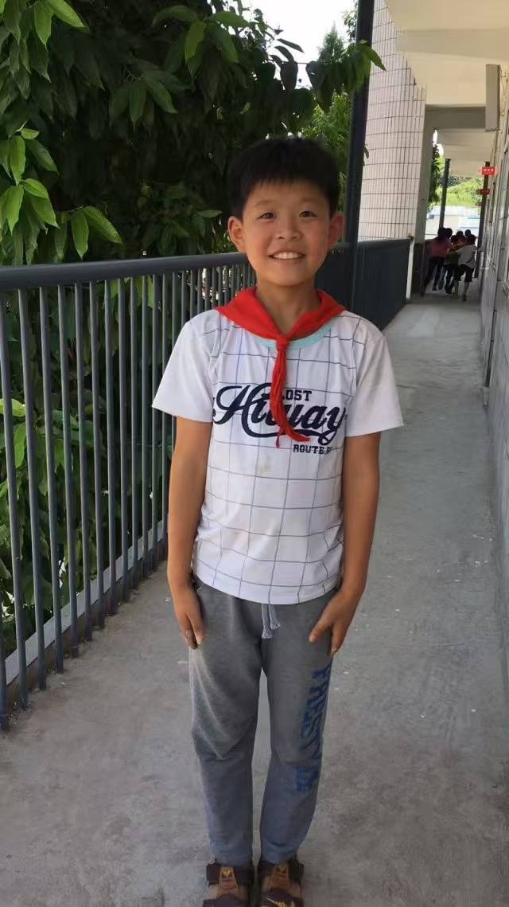
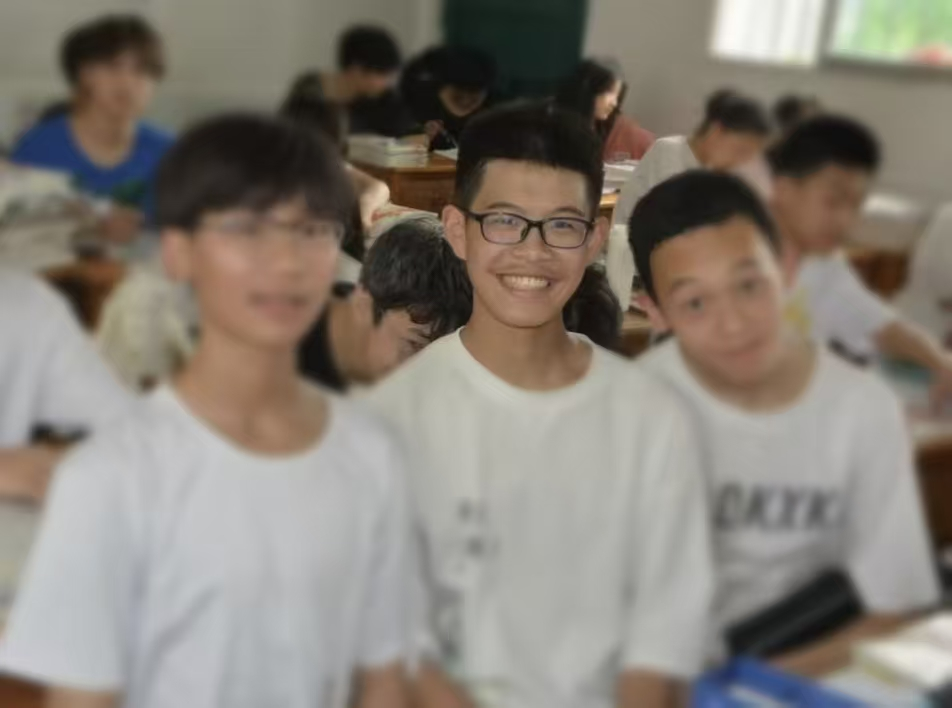
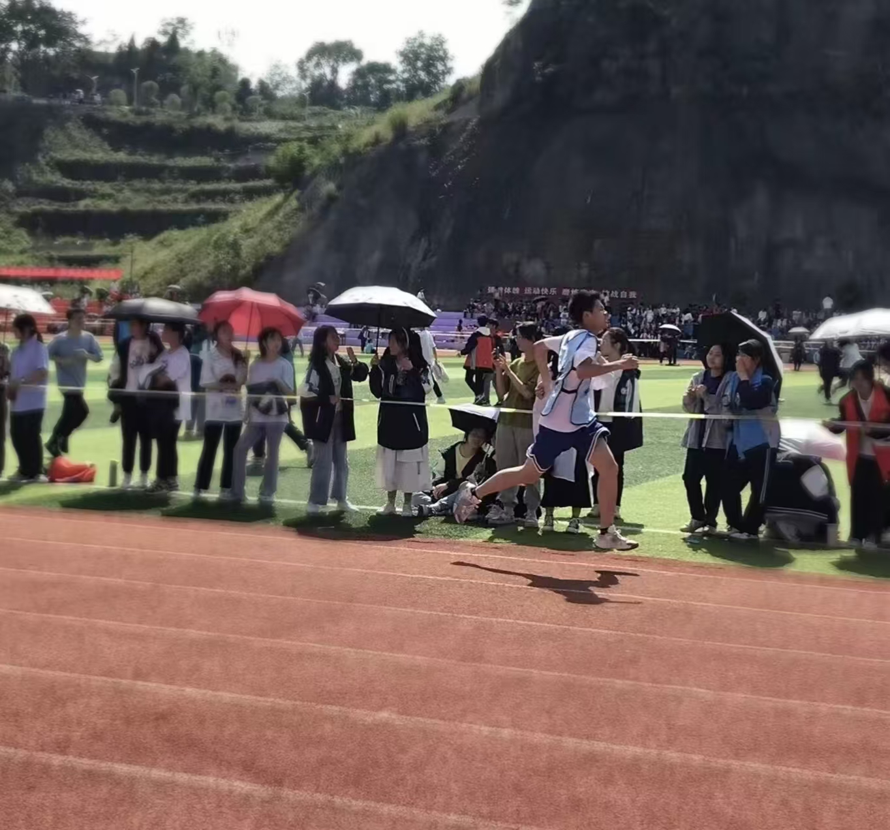
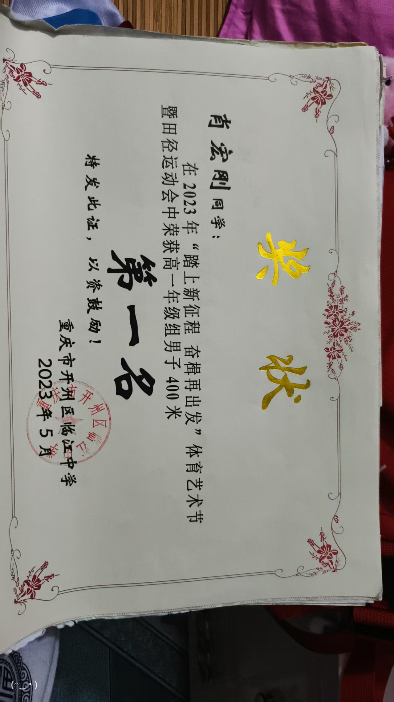
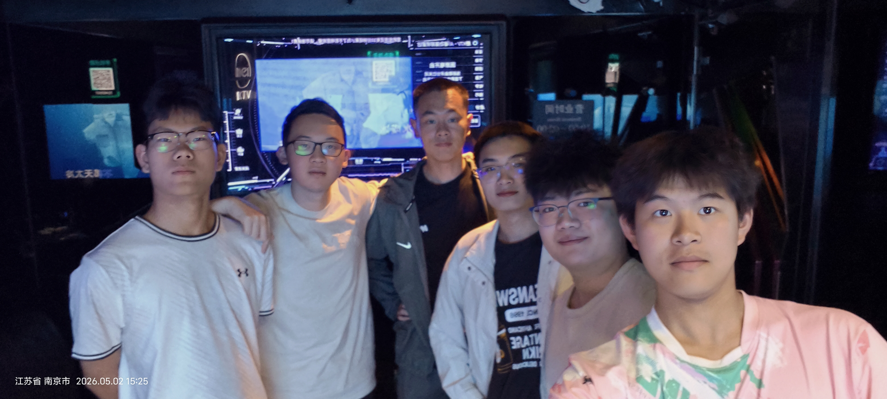

我叫小红，是一名普通的青年学子，我生长在重庆一座宁静质朴的小村庄。乡土的清风、淳朴的人情，滋养了我开朗纯粹的性格，也塑造了我从小踏实上进、不服输、肯坚持的本心。回首一路走来的求学之路，有年少意气风发的热烈，有奋力拼搏的汗水，有青涩懵懂的心事，也有直面落差、接纳平凡、默默成长的迷茫与坚韧，每一段经历，都是我人生最珍贵的印记。

## 一、乡土年少，初心向阳

我的童年平凡而温暖，家中有一位比我更懂事稳重的哥哥。在家人的呵护与引导下，我自小便乖巧听话、待人真诚，性格活泼开朗，是邻里长辈口中懂事优秀的"别人家的孩子"。那时的我，心思纯粹、心性向上，不懂何为懈怠，只知道踏实做事、认真成长，小小的心里，始终藏着一份不甘平庸的底气。

步入小学，我彻底爱上了学习，尤其痴迷数学。数字与逻辑的魅力深深吸引着我，让我始终保持着高涨的学习热情。彼时我的家乡地处偏僻，资源有限，镇上没有课外教辅书籍售卖，没有拓展学习的渠道，但我从未因此止步。为了精进自己的数学能力，我主动向数学老师求助，终于借到了一本奥数书。那段时光，我靠着一本旧书反复钻研、独自摸索，一点点拓宽自己的知识面。凭借热爱与坚持，我的成绩始终稳居班级前列。年少的我笃定地相信，只要足够努力，我会一直保持优秀，一直所向披靡。

## 二、少年启程，砥砺求学

时光荏苒，小学岁月匆匆而过。为了让我接受更好的教育，拥有更好的未来，爷爷奶奶倾尽心力，为我的学业奔波操劳。老家的初中教学资源薄弱、教学质量有限，他们不愿让我错失成长的机会，四处托人、费心打点，带着家里珍藏的蜂蜜、自养的土鸡四处奔走，最终将我送入了镇上的初中就读。

虽然费尽周折，我最终没能进入师资最好的班级，但年少的我心性豁达，从未心生抱怨。我始终坚信，学习的好坏从不由班级决定，只由自身的努力决定。刚踏入镇上的中学时，周遭皆是陌生的环境、陌生的同学，没有一个熟识的伙伴，我一度难以快速适应。但骨子里的傲气与韧劲支撑着我，我从不畏惧陌生，更不轻易认输。我自认天资尚可、肯下苦功，坚信自己依旧可以脱颖而出。

我的努力从未辜负自己。初中第一次大型考试，在全校一千余名学生中，我取得了全校第十四名、班级前三的优异成绩。这份成绩让我备受鼓舞，更加坚定了我深耕学习的信念。初中阶段，我也曾有过短暂青涩的懵懂情愫，匆匆而过，不留遗憾，成为青春里轻轻翻过的一页。此后的日子里，我兼顾学习与生活，始终保持昂扬向上的状态。那时的我意气风发、年少轻狂，心中满是骄傲与自信，天真地以为自己是人生的主角，前路坦荡、万事可期。

可成长从不会一帆风顺。步入初三，学业难度陡增，化学学科成了我最大的短板。无论我如何钻研、如何努力摸索，始终难以吃透知识点，成绩陷入瓶颈，无法再像从前一样稳步提升、突破自我。那段时间，我满心苦恼、倍感无力，只能咬牙坚持，熬过了压力重重的初三学年。中考之中，我的化学成绩依旧不尽人意，所幸我深耕多年的数学顶住了压力，考取一百四十多分的高分，凭借单科优势弥补了短板，顺利考入重点高中强基班，开启了全新的高中生涯。

## 三、青春逐梦，亦有回甘

进入重点高中强基班，我真正见识到了优秀者的模样。严厉负责的班主任、勤奋自律的身边同学、浓厚紧张的学习氛围，无时无刻不在激励着我奋勇向前。高中的我，不仅深耕学业，也坚持体育锻炼，在运动场上挥洒汗水，磨砺坚韧的意志。高一时，我在校运会斩获 400 米年级第一名、1500 米年级前八名的优异成绩；高二学年，我依旧坚持训练，在 400 米、1500 米长跑项目中持续保持优异水准，运动也成了我缓解学业压力、突破自我的重要方式。

高二的青春里，我也曾心生悸动，悄悄暗恋过一位温柔美好的女孩。年少的喜欢纯粹又安静，我将这份心意藏于心底，默默努力、静静观望，未曾惊扰。直至高考结束，我鼓起勇气告白，最终遗憾未能双向奔赴。时过境迁，如今的我早已全然释怀，只将这份青涩的心动珍藏为青春独有的美好回忆。

高中前两年，是我求学路上最充实、最轻松的时光。我平衡好学习与压力，疲惫时就独自一人在球场奔跑、打球，用汗水消解学业的疲惫，在松弛有度的节奏里稳步前行。凭借日复一日的坚持与自律，我的成绩长期稳定在年级前十，稳稳站在优秀的行列，依旧保持着少年的骄傲与底气。

## 四、高三风雨，得失成长

所有的转折与落差，都出现在高三。冲刺阶段的高压学习，彻底压缩了所有的放松时间。无休止的刷题、频繁的考试、紧绷的节奏，让我的神经时刻处于高度紧张的状态。长期的高压内耗，慢慢消磨了我的思维与状态。我依旧保持着往日的作息，依旧拼尽全力努力学习，可成绩却开始断崖式下滑。曾经唾手可得的年级前十，变成了遥不可及的奢望，甚至一度考出年级三十名的低谷成绩。

那段时间，是我高中最煎熬的日子。我满心困惑、满心不甘，明明从未懈怠，依旧全力以赴，为何换来的却是退步与落差？我习惯了在外人面前保持乐观开朗，伪装出云淡风轻的模样，可无人知晓，无数个深夜里，我会因为成绩下滑暗自难过、自我怀疑。老师殷切的期望、同学由衷的钦佩、自己坚守多年的骄傲，全部被残酷的成绩打破。

我年少时最大的理想，是考入军校、身披戎装、保家卫国，守护家国山河。为了这个梦想，我认真备考、严格自律，顺利通过了军校严苛的军检与面试，一路过关斩将，距离梦想仅有一步之遥。可命运终究留有遗憾，最终几分之差，让我与心心念念的军校失之交臂。

高考落幕，我最终的成绩只能进入一所普通 211 高校，就读计算机专业。梦想落空的失落、努力付诸东流的遗憾萦绕在心头，我纠结良久、反复斟酌，最终慢慢释然，说服自己坦然接受结果。我告诉自己，前路皆可奔赴，计算机亦是新的赛道，依然可以全力以赴、发光发热。

## 五、新程起航，温柔前行

怀揣着少年从未熄灭的傲气与憧憬，我离开故土，远赴陌生的城市开启大学生活。初入大学，我依旧延续着多年的执念，笃定自己可以像小学、初中、高中一样，披荆斩棘、所向披靡，在新的平台继续优秀。

步入大学，我始终珍惜真挚的同窗情谊，从未淡忘高中并肩同行的挚友。纵使异地求学、分隔两地，我与高中最好的朋友们依旧保持着紧密的联系，日常互相鼓励、彼此陪伴，岁岁年年情谊不变。2026 年五一假期，我和许久未见的高中好友相约同行，共赴南京出游。我们并肩游历山河、畅谈过往与未来，褪去学业的疲惫，重温年少并肩的温暖，这段美好的同行时光，也成为我大学生活里无比珍贵的治愈与美好。

可真正踏入大学校园，我也真切感受到了全新的差距与挑战。身边的同学大多基础扎实、见识更广，从小接触电子产品与专业知识，适应能力极强。而我，出身乡村，此前从未接触过电脑，所有的专业知识、设备操作，对我而言都是全然陌生的领域。一切都只能从零摸索、从头学起。

大学的学习模式彻底颠覆了我多年的学习习惯。高等数学抽象晦涩，脱离了高中的学习节奏与氛围，我再也找不到从前得心应手的学习状态；C 语言专业课程节奏极快，课堂讲授内容有限，大部分知识需要自主线上自学，零基础的我屡屡碰壁、难以吃透；英语本就是我的薄弱学科，身处高手云集的校园，看着身边同学流利自如的英语能力，我的自卑愈发浓烈；曾经擅长的田径体育，在人才济济的大学里也变得平平无奇，再也没有过人的闪光点。

曾经的我，是众人夸赞的优等生，是自带骄傲的少年；而如今，在全新的赛道上，我成了人群中最普通、最平庸的人。巨大的落差让我一度陷入自我怀疑，但骨子里的倔强从未消失。我不愿甘于平庸，不愿辜负多年的努力，依旧选择埋头深耕，用加倍的努力弥补基础的短板，一点点追赶他人的脚步。

## 六、接纳平凡，奔赴山海

一路走来，从乡村孩童到重点学子，再到普通的大学生，我见过意气风发的自己，也接纳了平凡普通的自己。如今的我，依然在默默努力、稳步前行。我深知，学习从不是一蹴而就的奇迹，而是循序渐进的积累。当下的努力或许无法立刻换来成绩的飞跃，但每一份坚持、每一份付出，都在为未来铺路。

褪去年少的轻狂，褪去无谓的骄傲，我慢慢学会接纳落差、接纳遗憾、接纳不完美的自己。我珍惜真挚的情谊，释怀青春的遗憾，沉淀浮躁的心态，在成长中慢慢温柔、慢慢坚定。前路漫漫，风雨兼程，我始终相信，不忘初心、步履不停，终能冲破迷茫、摆脱自卑，在属于自己的赛道上稳步成长、向阳生长。

以此自传，记录过往，期许未来。加油，始终坚韧、从未放弃的自己！

