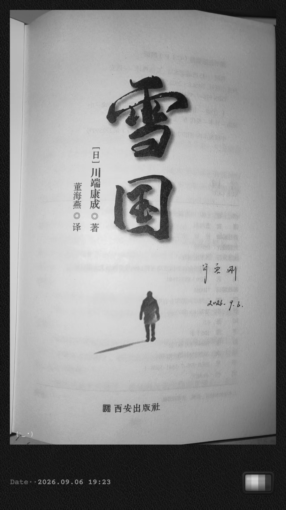
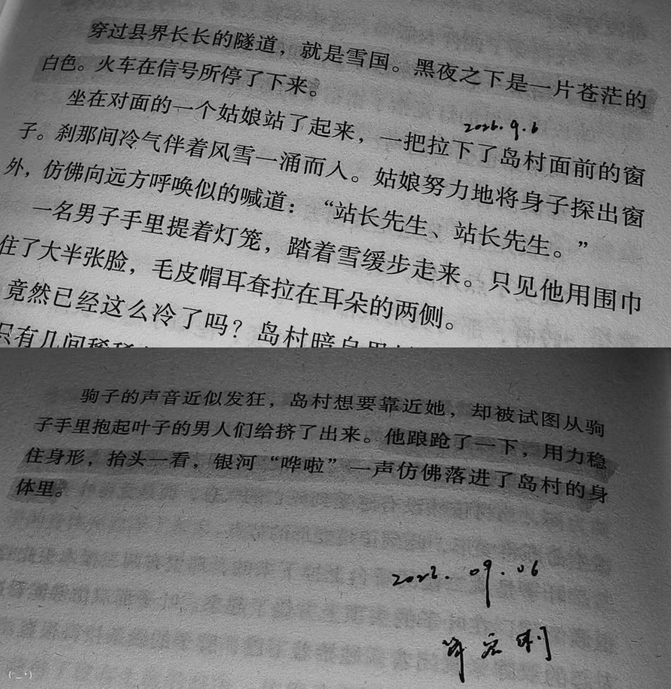

读完《雪国》，心里久久萦绕着一种安静的怅然。没有揪心的剧情，没有大悲大喜的跌宕，只有一片无边无际的白雪，清冷的夜色，和一场场抓不住、留不下的美好。川端康成的文字克制又温柔，像深夜无声飘落的雪花，轻轻覆在心上，让人慢慢读懂，人世间大多数执念与奔赴，原来皆是徒劳。

整本书的底色，是清冷的虚无。一条长长的隧道，隔开了世俗喧嚣，通往纯白静谧的雪国，也通往一场注定幻灭的温柔幻境。主人公岛村本就是带着松弛、虚无的心态来到这里，他看透世间浮华，对一切人事都保持着疏离与淡然。也正因如此，他旁观着雪国里所有人的执着与热烈，却始终置身事外。

驹子是雪国最鲜活、最滚烫的存在。身处泥泞的境遇里，她依然认真生活、执着热爱。她努力摆脱命运的桎梏，真诚待人，倾尽所有去奔赴一份真心。她的爱意热烈、纯粹且偏执，倾尽温柔，毫无保留。可这份拼尽全力的赤诚，在淡漠的世事和疏离的人心面前，显得格外单薄。在岛村眼中，这份滚烫的真心，从头到尾，都只是一场美丽却没有结果的徒劳。她越热烈，越执着，就越衬出这场相遇的荒芜与落空。

如果说驹子是烟火般鲜活的现实，那叶子就是雪国转瞬即逝的月光。她干净、温柔、澄澈，带着不食人间烟火的纯粹，是藏在风雪里最极致的美好。她遥远、易碎、不可触碰，只能远远凝望，永远无法真正拥有。她是所有人心中理想化的温柔，是虚无又惊艳的幻影。故事最后的火光撕碎寂静的雪夜，幻影骤然坠落，漫天银河轰然倾泻而下，落在空旷的天地间。那一刻，所有的期待、眷恋、憧憬与温柔，尽数崩塌，归于空无。

年少的时候，我始终相信，真心一定换真心，奔赴一定会有回响，所有认真珍惜的人和事，最终都会圆满落幕。我们总习惯性执着于结果，执着于双向的奔赴，执着于有始有终的故事。我们小心翼翼珍藏生活里细碎的温柔，为一点心动满心欢喜，为一份相遇满怀期待，固执地想要留住所有美好的瞬间。

可年岁渐长，再读《雪国》，终于慢慢释怀。
人间常态，本就是缺憾与落空。
青春里的心动与相遇，大多都是如此。干净纯粹，毫无杂质，却大多难逃无疾而终的结局。很多温柔的相遇，没有争吵，没有辜负，没有轰轰烈烈的离别，只是被时间推着渐行渐远。从无话不谈，到沉默疏离，最后悄悄退出彼此的生活，安静落幕。

从前会不甘，会遗憾，会反复回想如果当初。可如今终于明白，世间太多人事，从来不由人意。不是所有喜欢都能相守，不是所有相遇都能久伴，不是所有热烈奔赴，都能迎来圆满结局。

但川端康成笔下的 "徒劳"，从来不是彻底的悲凉。
徒劳不代表无用，落空不代表浪费。

驹子的深情没有归宿，可她坦荡热烈地爱过、认认真真地活过，这份赤诚本身就足够珍贵；那些停留在青春里的温柔心动，纵然没有结局，也曾温柔过漫长的岁月，装点过最纯粹的年少时光。所有悄悄珍藏的美好，默默付出的温柔，小心翼翼的心动，都是青春最真实、最干净的痕迹。

雪国的风雪年年往复，洁白如初，却留不住任何一瞬的美好。星河璀璨一时，终究会隐入沉沉夜色。世间所有极致的温柔与美好，生来短暂，注定留白。

成长大抵就是慢慢接受这种徒劳。
接受世事无常，接受遗憾常态，接受有些人只能路过，有些故事只能定格在曾经。不再执着于圆满，不再纠结于结局，学会珍藏相遇的温柔，坦然接受离别的落空。

雪落无声，风月依旧。
那些藏在时光里的温柔与遗憾，那些无人知晓的心动与奔赴，终会像雪国的落雪一样，悄然消融，沉淀心底。
看似空空如也，实则温柔满程。
这大概就是人间最温柔的徒劳，也是青春最动人的底色。

